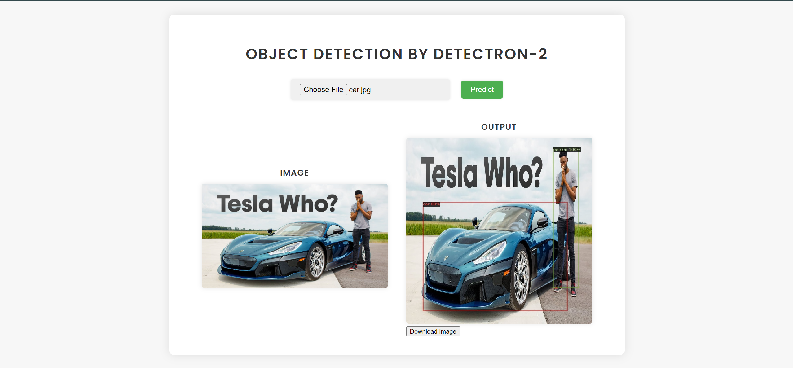

# Flask App with Object Detection using Detectron2

This is a Flask web application that performs object detection on images using Facebook's Detectron2 library. It allows users to upload an image, runs object detection on the image, and displays the detected objects along with their bounding boxes.

## Setup

1. Clone the repository:

    ```bash
    git clone <repository_url>
    ```

2. Install the required packages:

    ```bash
    pip install -r requirements.txt
    ```

3. Download and setup Detectron2:

    Follow the instructions on the [Detectron2 GitHub page](https://github.com/facebookresearch/detectron2) to download and install Detectron2.
    python -m pip install 'git+https://github.com/facebookresearch/detectron2.git'

4. Run the Flask app:

    ```bash
    python app.py
    ```

5. Open a web browser and go to `http://localhost:5000` to access the web application.

## Usage

- Upload an image using the provided file upload button.
- Click on the "Detect Objects" button to perform object detection on the uploaded image.
- The detected objects along with their bounding boxes will be displayed on the image.

## UI

## Directory Structure

- `app.py`: Main Flask application file.
- `templates/`: Directory containing HTML templates for the web pages.
- `static/`: Directory containing static files (e.g., CSS, JavaScript).
- `uploads/`: Directory where uploaded images are stored temporarily.

## Credits

- [Facebook Detectron2](https://github.com/facebookresearch/detectron2): Open-source library for object detection and instance segmentation.

## License

This project is licensed under the MIT License - see the [LICENSE](LICENSE) file for details.
